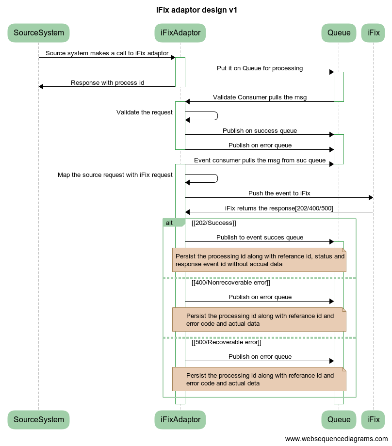

# iFix Adapter Services v1.0

## Overview

&#x20;Ifix-Adapter is a system that works as a mediator between iFix and its clients. This system will receive requests from the client system and convert the data in the Ifix required format. This document contains the details about how to set up ifix-adapter service and describes the functionalities it provides.

## Pre-requisites

Before you proceed with the configuration, make sure the following pre-requisites are met -

* _Java 8_
* Kafka server is up and running
* PSQL server is running
* Redis
* Following services should be up and running:
  * Client Service Like mgramseva-ifix-adapter
  * Target service IFIX- fiscal-event-service
  * Target Service IFIX-keycloak
  * IFIX master-data-service

## Key Functionalities

* IFIX client requests are pushed to IFIX
* The authentication token is fetched from keycloak and cached. Token will be re-fetched 5 minutes before expiry
* project id is fetched from IFIX and cached
* COA id fetched from IFIX and cached
* Every push to IFIX is recorded in the table with HTTP status
  * status series 200 considered success
  * status 400 are marked client error and reported back to the client
  * status 500 resubmitted by the scheduler

## Deployment Details

Deploy the latest version of ifix-reference-adapter

| **Environment Variables**                                          | **Description**                                                                                                                     |
| ------------------------------------------------------------------ | ----------------------------------------------------------------------------------------------------------------------------------- |
| `kafka.topics.ifix.adaptor.mapper`                                 | Topic in which client requests are put . From this further listen and posting happens                                               |
| `keycloak.host`                                                    | Host name of the key cloak authentication token provider                                                                            |
| `keycloak.token.url`                                               | key cloak authentication token url                                                                                                  |
| `keycloak.credentials.clientid`                                    | userid of for authentication token                                                                                                  |
| `keycloak.credentials.clientsecret`                                | password for authentication token                                                                                                   |
| `ifix.host`                                                        | host name of IFIX server                                                                                                            |
| `ifix.event.url`                                                   | IFIX post URL                                                                                                                       |
| `spring.redis.host`                                                | Host name of the redis server                                                                                                       |
| `state.goverment.code`                                             | top level tenant id of the client                                                                                                   |
| `ifix.coa.search.url`                                              | url for COA search in IFIX                                                                                                          |
| `ifix.project.search.url`                                          | Url for the project code search in IFIX                                                                                             |
| `spring.jpa.properties.hibernate.dialect`                          | dialect for JPA. you can change this to oracle or my sql etc                                                                        |
| `spring.jpa.properties.hibernate.jdbc.lob.non_contextual_creation` | will generate the required tables in the respective database . This feature is used instead of flyway to get database in-dependency |

## Configuration Details

1. Update Key cloak credentials in dev.yaml,qa.yaml,prod.yaml according to the environment The credentials are “`keycloak.credentials.clientid` and “`keycloak.credentials.clientsecret`” Example is given in [here](https://github.com/egovernments/iFix-DevOps/blob/27c67ad236f06ad2e6a139c4d59111db184f8705/deploy-as-code/helm/environments/mgramseva-qa.yaml#L224) and [here](https://github.com/egovernments/iFix-DevOps/blob/27c67ad236f06ad2e6a139c4d59111db184f8705/deploy-as-code/helm/environments/mgramseva-qa-secrets.yaml#L65)
2. Map **clientcode**, **ifixcoacode**, **ifixid** in **ifix\_adapter\_coa\_map** table
   1. “clientcode” is the tax head like “WATER\_CHARGES” or ‘10011’ used in IFIX client like mgramseva
   2. “ifixcoacode” is the 16 digit glcode in IFIX. 16 digit code is mapped then this can be ported to any environment like dev to qa ,or qa to uat or from uat to prod. Prefer mapping ifixcoacode
   3. Another way is to map the IFIX COA ID itself. Since these are generated ids you cant port to other environments. ID mapping has to be done for every environment.
   4. Preference is given to COA Code, if it is null ID will be used
   5. example is INSERT INTO public.ifix\_adapter\_coa\_map(\
      id, clientcode, ifixcoacode, ifixid, tenantid)\
      VALUES (1,'10101', '0215-01-102-00-00-01', '6cbcb4a1-2431-4f78-89d7-b4f0565aba37', 'pb');
3. If client “project code” and IFIX project code are the same then no need for mapping. If it is different then map **clientprojectcode**, **ifixprojectid** in **ifix\_adapter\_project\_map** table. Ideally, you should keep both codes the same for getting meaningful data on the dashboard. This way you don't have to do any mapping for project code for any environment. But if for any reason you have different project codes in IFIX and its client or has multiple projects having the same project code then only go for this mapping. The adapter will first check in the IFIX for the supplied “projectCode”, If found it will use it and caches it. If multiple projects or not found it will look into this table for mapping
   1. example is INSERT INTO public.ifix\_adapter\_project\_map(\
      id, clientprojectcode, ifixprojectid, tenantid)\
      VALUES (1, '7374', 'e42db9bb-8427-40a6-9939-4f2189d032bf','pb');
4. `state.goverment.code` set this value to the clients top level tenantid

## Interaction Diagram

## Reference Docs

### Doc Links

|                      | **Link**                                                                                                                                                                                                           |
| -------------------- | ------------------------------------------------------------------------------------------------------------------------------------------------------------------------------------------------------------------ |
| Api Swagger document | [ iFix-Dev/iFix-adapter-v1.0.yaml at adaptor-dev · egovernments/iFix-Dev](https://github.com/egovernments/iFix-Dev/blob/adaptor-dev/reference-adapter/iFix-adapter-v1.0.yaml) |
| Postman              | [https://www.getpostman.com/collections/c3414cc054346e17aea2](https://www.getpostman.com/collections/c3414cc054346e17aea2)                                                                                         |

### API List

| **API**          | **Description**                                                                             |
| ---------------- | ------------------------------------------------------------------------------------------- |
| events/v1/\_push | API for receiving data from the client (mgram). This is the only API present in the adapter |
