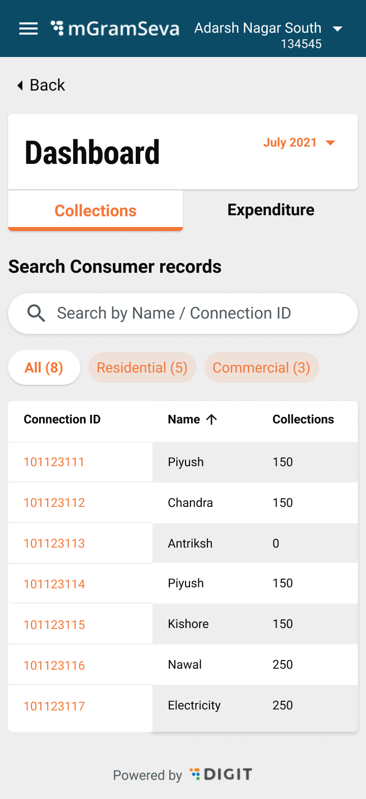

# Tabular Dashboard - Collection

Clicking on the Dashboard on the home screen navigates the user to the revenue dashboard view for the current month. This provides a tabular view with the list of consumer records.

Following are the data points/actions needed on the screen

<table>
  <thead>
    <tr>
      <th style="text-align:left"></th>
      <th style="text-align:left"></th>
      <th style="text-align:left"></th>
    </tr>
  </thead>
  <tbody>
    <tr>
      <td style="text-align:left">1</td>
      <td style="text-align:left">Search Consumer records</td>
      <td style="text-align:left">
        <ul>
          <li>Search by name or connection ID</li>
          <li>Name should be a partial match. As the user starts typing a consumer name,
            respective consumers get filtered in the table displayed below</li>
          <li>Connection ID should be a partial match. This is the new connection ID.
            As the user starts typing a New connection ID, respective consumers get
            filtered in the table displayed below</li>
        </ul>
      </td>
    </tr>
    <tr>
      <td style="text-align:left">1.1</td>
      <td style="text-align:left">Filters</td>
      <td style="text-align:left">
        <ul>
          <li>Default is &#x201C;All&#x201D; View. Switching to Residential or commercial
            filters table accordingly. Alongside the filter, how many consumers fall
            into that filter is shown in numbers</li>
          <li>The table also has sort options for each column (ascending, descending)</li>
        </ul>
      </td>
    </tr>
    <tr>
      <td style="text-align:left">1.2</td>
      <td style="text-align:left">Columns</td>
      <td style="text-align:left">
        <ul>
          <li>Connection ID
            <ul>
              <li>New Connection ID of the consumer- this should be clickable, and take
                users to the HH details page</li>
              <li>A metered connection should have &#x201C;M&#x201D; in a &#x2B55;&#xFE0F;
                that is followed across as standard for metered connection</li>
            </ul>
          </li>
          <li>Name
            <ul>
              <li>name of the consumer. Show until 20 Characters and truncate by showing
                3 dots if the name is longer</li>
            </ul>
          </li>
          <li>Collections - Amount paid by the user in that month</li>
        </ul>
      </td>
    </tr>
  </tbody>
</table>

