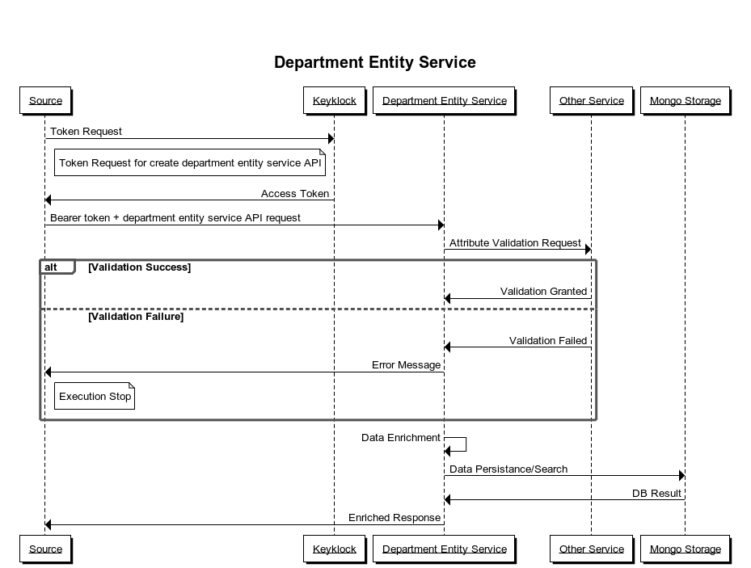

# Department Entity Service

## Overview

Department Entity service manages the department and its hierarchies metadata, it just deals with department entity and department hierarchy.  
Department Hierarchy store only hierarchies definition like metadata for department level and department entity stores actual department data with its ancestry information.

## Version History

Current Version: 0.1.0

## Prerequisites

Before you proceed with the configuration, make sure the following pre-requisites are met.

1. Java 8
2. MongoDB instance.
3. Required Service Dependencies - iFIX-Master-Data-Service

## Features

### Department Hierarchy

It defines the hierarchy definition for the department.

* department id: It is the ID of the department from the department master.
* level: It defines the depth of hierarchy of department level.
* parent: It provides details about department hierarchy parent \(UUID\).

#### Department Entity 

It contains department entity information along with its hierarchy level and also attaches master department information \(department id - UUID\). Here we keep all children information list at every department node \(department record\). Leaf level department will not have any children info.  
Children list contains department entity id list, which makes current department entity parent of all children list \(department id list\), that's how it maintains department entity level.

#### Level value evaluation 

1. Root level department hierarchy will not contain any parent value and level value will be zero.
2. When parent id is having any value then we search parent in department hierarchy record for hierarchy level evaluation.
3. Get level value from parent department hierarchy and increment current department hierarchy level value by one.

#### Hierarchy Level approach 

First, we need to define the hierarchy level top to bottom because it has parent's reference. Department entity do creation in bottom-to-top approach. Leaf department entity does not have any child reference. When the department entity goes higher \(parent\) only then it defines child reference in its child list.

### Department Hierarchy Request Action

1. **Create Department Hierarchy** We pass the current hierarchy level and its parent details along with master department and tenant information. It stores data as meta-information about hierarchy level for department entity data processing, it will be working as a reference meta index which will tell about hierarchy level information.
2. **Search Department Hierarchy** It just provides a preview of department hierarchies by providing request parameters - tenant Id, hierarchy level or department hierarchy id.

### Department Entity Request action

1. **Create Department Entity** It passes tenant Id, master department id, hierarchy level, its children list with department entity name and code. Tenant, hierarchy level and the master department is root info about the department entity. If the department entity does not contain any children that means it is a leaf department entity it can only seek for its parent.
2. **Search Department Entity** It can make search requests based on any department entity attribute but can't skip tenant information, it will return whole department entity details along with its children information. It finds all ancestry information of the current department entity.

## Interaction Diagram

## Configurations and Setup

1. Update all the DB and URI configuration in the dev.yaml, qa.yaml, prod.yaml file.
2. Make sure Keycloak server is up and running And have been configured with the required client ID.

Reference:

* [Swagger.YAML](https://redocly.github.io/redoc/?url=https://raw.githubusercontent.com/egovernments/iFix-Dev/develop/domain-services/ifix-department-entity-service/ifix-department-entity-service-0.1.0.yaml)
* [Postman Collection](https://www.getpostman.com/collections/b330dc3698bf009d2ef5)
* [Migration Scripts](https://github.com/egovernments/iFix-Dev/tree/develop/domain-services/ifix-department-entity-service/src/main/resources/db/migration)

