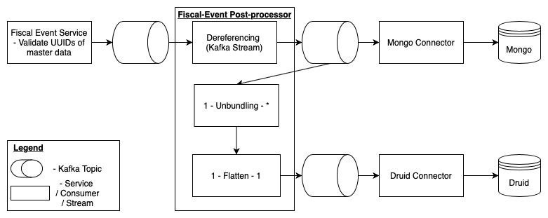

# iFix Fiscal Event Post Processor

## Overview

Fiscal Event Post Processor is a streaming pipeline for validated fiscal event data. Apache Kafka has been used to stream the validated fiscal event data, process it for dereference, unbundle, flatten And finally push these details to Mongo and Druid data store.

## Version History

Current version : 0.1.0

## Prerequisites

Before you proceed with the configuration, make sure the following pre-requisites are met

1. Java 8
2. Apache Kafka and Kafka-Connect server should be up and running.
3. Druid DB & MongoDB should be up and running.
4. Below dependent services are required :  iFix Master data service.  iFix Fiscal Event service.

## Features

Fiscal Event post-processor consumes the fiscal event validated data from Kafka topic named “fiscal-event-request-validated” and process it by following below steps :

1. Fiscal event validated data will get dereferenced. For dereferencing, pass the service ids like project id, COA id, Tenant id etc. to corresponding services - Master service & Department Entity service And get the corresponding object\(s\). Once the fiscal event data is dereferenced, push/send the same data to Mongo Sink and dereference Topic.
2. Mongo connector will pick up the data from the “fiscal-event-mongodb-sink“ topic and push it to Mongo Datastore.
3. Unbundle consumers will pick up the dereferenced fiscal event data from the dereferenced topic. Dereference fiscal event data will get unbundled and then flattened. Once the flattening is complete, push/send the same data to Druid Sink topic.
4. Flattened fiscal event data will be pushed to Druid DB from a topic named: fiscal-event-druid-sink.

## Kafka to Data Store Sink

### MongoDB Sink

We use Kafka-connect to push the data from a Kafka topic to MongoDB. Follow these steps to start the connector:

1. Connect \(port-forward\) with the Kafka-connect server.
2. Create a new connector with a POST API call to localhost:8083/connectors.
3. The request body for that API call is written in the file [fiscal-event-mongodb-sink](https://github.com/egovernments/iFix-Dev/blob/develop/domain-services/fiscal-event-post-processor/fiscal-event-mongodb-sink.json).
4.  Within that file, wherever ${---} replace it with the actual value based on the environment. Get ${mongo-db-authenticated-uri} from the configured secrets of the environment. \(Optional\) Verify and make changes to the topic names.
5.  The connector is ready. You can check it using API call GET localhost:8083/connectors.

### Druid Sink

We use the Druid console to start ingesting data from a Kafka topic to the Druid data store. Follow the steps mentioned below to start the Druid Supervisor

1. Open the Druid console
2. Go to the Load Data section
3. Select Other
4. Click on Submit Supervisor
5. Copy...Paste the JSON from the [druid-ingestion-config.json](https://github.com/egovernments/iFix-Dev/blob/develop/domain-services/fiscal-event-post-processor/druid-ingestion-config.json) file in the available text box
6. Verify the Kafka topic name and the Kafka bootstrap server address before submitting the config
7. Submit the config and the data ingestion should start into the fiscal-event data source

## Interaction Diagram

## Environment

_**Note**: Kafka topic needs to be configured with respect to the environment_

|  **Key** | **Value** | **Description** | **Remarks** |
| :--- | :--- | :--- | :--- |
| `fiscal-event-kafka-push-topic` | `fiscal-event-request-validated` | Fiscal event post-processor consumes data from this topic | Kafka topic should be the same as configured in the Fiscal event service. |
| `fiscal-event-kafka-dereferenced-topic` | `fiscal-event-request-dereferenced` | Dereferenced fiscal event data is pushed to this topic | NA |
| `fiscal-event-kafka-flattened-topic` | `fiscal-event-line-item-flattened` | NA | NA |
| `fiscal-event-processor-kafka-mongodb-topic` | `fiscal-event-mongodb-sink` | Dereferenced fiscal event data is pushed to this topic and is consumed - Kafka connect to persist in Mongo Data Store | Mongo Kafka connects topic should be the same. |
| `fiscal-event-processor-kafka-druid-topic` | `fiscal-event-druid-sink` | Flattened Fiscal Event data is pushed to this topic. | While druid ingests fiscal events, make sure it has the same topic as mentioned here |

## Configurations and Setup

Update all the DB, Kafka producer & Consumer And URI configuration in the dev.yaml, qa.yaml, prod.yaml file.

## References and Notes

| **Title** | **Link** |
| :--- | :--- |
| Swagger Yaml | [iFix-Dev/fiscal-event-post-processor-1.0.0.yaml at develop · egovernments/iFix-Dev](https://github.com/egovernments/iFix-Dev/blob/develop/domain-services/fiscal-event-post-processor/fiscal-event-post-processor-1.0.0.yaml) |

