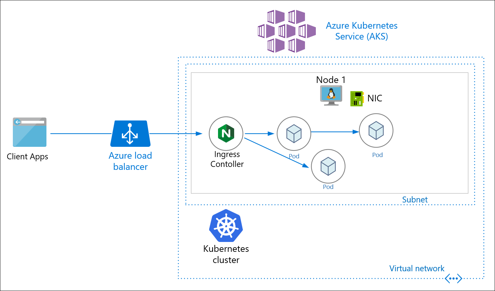

# On Azure

The **Azure Kubernetes Service (AKS)** is one of the Azure services used for deploying, managing, and scaling any distributed and containerized workloads. Here we can provision the AKS cluster on Azure from the ground up and using an automated way (infra-as-code) using [**terraform**](https://www.terraform.io/intro/index.html) and then deploy the DIGIT-iFIX Services config-as-code using [**Helm**](https://helm.sh/docs/).

This quickstart assumes a basic understanding of Kubernetes concepts. For more information, see [Kubernetes core concepts for Azure Kubernetes Service (AKS)](https://docs.microsoft.com/en-us/azure/aks/concepts-clusters-workloads).

If you don't have an [Azure subscription](https://docs.microsoft.com/en-us/azure/guides/developer/azure-developer-guide#understanding-accounts-subscriptions-and-billing), create a [free account](https://azure.microsoft.com/free/?ref=microsoft.com) before you begin.

## Prerequisites

*   Use the Bash environment in [Azure Cloud Shell](https://docs.microsoft.com/en-us/azure/cloud-shell/quickstart).

    [](https://shell.azure.com)
* If you prefer, [install](https://docs.microsoft.com/en-us/cli/azure/install-azure-cli) the Azure CLI to run CLI reference commands.
  * If you're using a local installation, sign in to the Azure CLI by using the [az login](https://docs.microsoft.com/en-us/cli/azure/reference-index#az\_login) command. To finish the authentication process, follow the steps displayed in your terminal. For additional sign-in options, see [Sign in with the Azure CLI](https://docs.microsoft.com/en-us/cli/azure/authenticate-azure-cli).
  * When you're prompted, install Azure CLI extensions on first use. For more information about extensions, see [Use extensions with the Azure CLI](https://docs.microsoft.com/en-us/cli/azure/azure-cli-extensions-overview).
  * Run [az version](https://docs.microsoft.com/en-us/cli/azure/reference-index?#az\_version) to find the version and dependent libraries that are installed. To upgrade to the latest version, run [az upgrade](https://docs.microsoft.com/en-us/cli/azure/reference-index?#az\_upgrade).
* This article requires version 2.0.64 or greater of the Azure CLI. If using Azure Cloud Shell, the latest version is already installed.
* The identity you are using to create your cluster has the appropriate minimum permissions. For more details on access and identity for AKS, see [Access and identity options for Azure Kubernetes Service (AKS)](https://docs.microsoft.com/en-us/azure/aks/concepts-identity).
* Install [**kubectl**](https://kubernetes.io/docs/tasks/tools/) on your local machine that helps you interact with the kubernetes cluster
* &#x20;Install [**Helm**](https://helm.sh/docs/intro/install/) that helps you package the services along with the configurations, envs, secrets, etc into a [**kubernetes manifests**](https://devspace.cloud/docs/cli/deployment/kubernetes-manifests/what-are-manifests)
* Install [**terraform**](https://releases.hashicorp.com/terraform/0.14.10/) version (0.14.10) for the Infra-as-code (IaC) to provision cloud resources as code and with desired resource graph and also it helps to destroy the cluster at one go.

&#x20;Note:  Run the commands as administrator if you plan to run the commands in this quickstart locally instead of in Azure Cloud Shell.

## AKS Architecture

Before we provision the cloud resources, we need to understand and be sure about what resources need to be provisioned by terraform to deploy DIGIT. The following picture shows the various key components. (AKS, Worker Nodes, Postgres DB, Volumes, Load Balancer)&#x20;



AKS Architecture for iFix Setup

Considering the above deployment architecture, the following is the resource graph that we are going to provision using terraform in a standard way so that every time and for every env, it'll have the same infra.

* AKS Azure (Kubernetes Service Master)
* Work node group (VMs with the estimated number of vCPUs, Memory
* Volumes (Persistent Volumes)
* PostGres Database
* Virtual Network
* Users to access, deploy and read-only

## Understand the **Resource Graph in** Terraform Script <a href="set-up-and-initialize-your-terraform-workspace-1" id="set-up-and-initialize-your-terraform-workspace-1"></a>

* Ideally, one would write the terraform script from the scratch using this [doc](https://learn.hashicorp.com/collections/terraform/modules).
* Here we have already written the terraform script that provisions the production-grade DIGIT Infra and can be customized with the specified configuration.
* Let's Clone the [iFix-DevOps](https://github.com/misdwss/iFix-DevOps) GitHub repo where the terraform script to provision AKS cluster is available and below is the structure of the files.

```
git clone --branch release https://github.com/misdwss/iFix-DevOps.git
cd iFix-DevOps/infra-as-code/terraform


└── modules
    ├── db
    │   └── azure
    │       ├── main.tf
    │       ├── outputs.tf
    │       └── variables.tf
    ├── kubernetes
    │   └── azure
    │       ├── main.tf
    │       ├── outputs.tf
    │       └── variables.tf
    ├── node-pool
    │   └── azure
    │       ├── main.tf
    │       ├── outputs.tf
    │       └── variables.tf
    └── storage
        └── azure
            ├── main.tf
            ├── outputs.tf
            └── variables.tf
    ​
```

The following main.tf contains the detailed resource definitions that need to be provisioned, please have a look at it.

&#x20;Dir: iFix-DevOps/Infra-as-code/terraform/aks-ifix-dev

&#x20;[**main.tf**](https://github.com/egovernments/DIGIT-DevOps/blob/release/infra-as-code/terraform/sample-aws/main.tf)

```
provider "azurerm" {
  # whilst the `version` attribute is optional, we recommend pinning to a given version of the Provider
  version = "~>2.0"
  features {}
  subscription_id  = "71f67180-c7fb-43dd-988a-e9f9e3135adc"
  tenant_id        = "b36b0fbe-cea1-4178-8664-ba81a1e51765" 
  client_id = "${var.client_id}"
  client_secret = "${var.client_secret}"
}

resource "azurerm_resource_group" "resource_group" {
  name     = "${var.resource_group}"
  location = "${var.location}"
  tags = {
     environment = "${var.environment}"
  }
}

module "kubernetes" {
  source = "../modules/kubernetes/azure"
  environment = "${var.environment}"
  name = "${var.environment}"
  ssh_public_key = "~/.ssh/id_rsa.pub"
  location = "${azurerm_resource_group.resource_group.location}"
  resource_group = "${azurerm_resource_group.resource_group.name}"
  client_id = "${var.client_id}"
  client_secret = "${var.client_secret}"
  nodes = "1"
  vm_size = "Standard_DS2_v2"
}

module "node-group" {  
  for_each = toset(["ifix", "mgramseva"])
  source = "../modules/node-pool/azure"
  node_group_name     = "${each.key}ng"
  cluster_id          = "${module.kubernetes.cluster_id}"
  vm_size             = "Standard_D4ds_v4"
  nodes          = 2
}

module "zookeeper" {
  source = "../modules/storage/azure"
  environment = "${var.environment}"
  itemCount = "3"
  disk_prefix = "zookeeper"
  location = "${azurerm_resource_group.resource_group.location}"
  resource_group = "${module.kubernetes.node_resource_group}"
  storage_sku = "Premium_LRS"
  disk_size_gb = "5"
  
}

module "kafka" {
  source = "../modules/storage/azure"
  environment = "${var.environment}"
  itemCount = "3"
  disk_prefix = "kafka"
  location = "${azurerm_resource_group.resource_group.location}"
  resource_group = "${module.kubernetes.node_resource_group}"
  storage_sku = "Standard_LRS"
  disk_size_gb = "100"
  
}
module "es-master" {
  source = "../modules/storage/azure"
  environment = "${var.environment}"
  itemCount = "3"
  disk_prefix = "es-master"
  location = "${azurerm_resource_group.resource_group.location}"
  resource_group = "${module.kubernetes.node_resource_group}"
  storage_sku = "Premium_LRS"
  disk_size_gb = "2"
  
}
module "es-data-v1" {
  source = "../modules/storage/azure"
  environment = "${var.environment}"
  itemCount = "3"
  disk_prefix = "es-data-v1"
  location = "${azurerm_resource_group.resource_group.location}"
  resource_group = "${module.kubernetes.node_resource_group}"
  storage_sku = "Premium_LRS"
  disk_size_gb = "100"
  
}

module "kafka-ifix" {
  source = "../modules/storage/azure"
  environment = "${var.environment}"
  itemCount = "3"
  disk_prefix = "kafka-ifix"
  location = "${azurerm_resource_group.resource_group.location}"
  resource_group = "${module.kubernetes.node_resource_group}"
  storage_sku = "Standard_LRS"
  disk_size_gb = "100"
  
}

module "zookeeper-ifix" {
  source = "../modules/storage/azure"
  environment = "${var.environment}"
  itemCount = "3"
  disk_prefix = "zookeeper-ifix"
  location = "${azurerm_resource_group.resource_group.location}"
  resource_group = "${module.kubernetes.node_resource_group}"
  storage_sku = "Premium_LRS"
  disk_size_gb = "5"
  
}

module "postgres-db" {
  source = "../modules/storage/azure"
  environment = "${var.environment}"
  itemCount = "2"
  disk_prefix = "postgres-db"
  location = "${azurerm_resource_group.resource_group.location}"
  resource_group = "${module.kubernetes.node_resource_group}"
  storage_sku = "Premium_LRS"
  disk_size_gb = "20"
  
}
```

## Custom Variables/Configurations <a href="set-up-an-environment" id="set-up-an-environment"></a>

You can define your configurations in **variables.tf** and provide the env specific cloud requirements so that using the same terraform template you can customize the configurations.

```
├── aks-iFix-dev
│   ├── main.tf 
│   ├── outputs.tf
│   ├── providers.tf
│   ├── remote-state
│   │   └── main.tf
│   └── variables.tf

```

Following are the values that you need to mention in the following files, the blank ones will be prompted for inputs while execution.

**​**[**variables.tf**](https://github.com/egovernments/DIGIT-DevOps/blob/release/infra-as-code/terraform/sample-aws/variables.tf) ​

```
## Add Cluster Name
variable "cluster_name" {
  default = "<Desired Cluster name>"  #eg: my-digit-aka
}
## Environment Name
variable "environment" {
    default = "<Desired Environment name>"  #eg: mgramsewa-qa
}
## Resource Group Name
variable "resource_group" {
    default = "<Desired Resource Group name>"  #eg: mgramsewa-qa
}
## Location Name
variable "location" {
    default = "<Desired Location name>"  #eg: southeastAsia
}

```

## ​Run terraform

Now that we know what the terraform script does, the resources graph that it provisions and what custom values should be given with respect to your env.

Let's begin to run the terraform scripts to provision infra required to Deploy DIGIT on AZ.

1. First CD into the following directory and run the following command 1-by-1 and watch the output closely.

```
cd DIGIT-DevOps/infra-as-code/terraform/aks-ifix-dev
terraform init
terraform plan
terraform apply
```

&#x20;Upon Successful execution following resources gets created which can be verified by the command "terraform output"

* **Network: **Virtual Network.
* **AKS cluster:** with nodepool(s), master(s) & worker node(s).
* **Storage(s):** for es-master, es-data-v1, es-master-infra, es-data-infra-v1, zookeeper, kafka, kafka-infra.

## Connect to the cluster

To manage a Kubernetes cluster, use the Kubernetes command-line client, [kubectl](https://kubernetes.io/docs/user-guide/kubectl/). `kubectl` is already installed if you use Azure Cloud Shell.

1.  Install `kubectl` locally using the [az aks install-cli](https://docs.microsoft.com/en-us/cli/azure/aks#az\_aks\_install\_cli) command:

    ```
    az aks install-cli
    ```
2.  Configure `kubectl` to connect to your Kubernetes cluster using the [az aks get-credentials](https://docs.microsoft.com/en-us/cli/azure/aks#az\_aks\_get\_credentials) command. The following command:

    * Downloads credentials and configures the Kubernetes CLI to use them.
    * Uses `~/.kube/config`, the default location for the [Kubernetes configuration file](https://kubernetes.io/docs/concepts/configuration/organize-cluster-access-kubeconfig/). Specify a different location for your Kubernetes configuration file using _--file_.

    ```
    az aks get-credentials --resource-group myResourceGroup --name myAKSClusteVerify the connection to your cluster using the  command. This command returns a list of the cluster nodes.
    ```

3\. Finally, Verify that you are able to connect to the cluster by running the following command

```
kubectl config use-context <your cluster name>

kubectl get nodes

NAME                       STATUS   ROLES   AGE     VERSION
aks-nodepool1-31718369-0   Ready    agent   6m44s   v1.12.8 
```

Whola! All set and now you can go with [Deploy Product](./#v-1-choose-the-cloud)..
