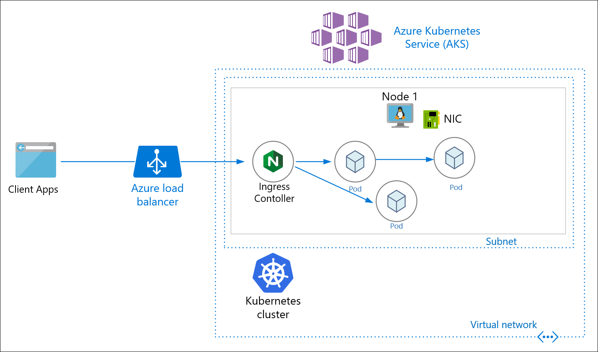

# On Azure

The **Azure Kubernetes Service \(AKS\)** is one of the Azure services used for deploying, managing, and scaling any distributed and containerized workloads. Here we can provision the AKS cluster on Azure from the ground up and using an automated way \(infra-as-code\) using [**terraform**](https://www.terraform.io/intro/index.html) and then deploy the DIGIT-iFIX Services config-as-code using [**Helm**](https://helm.sh/docs/).

This quickstart assumes a basic understanding of Kubernetes concepts. For more information, see [Kubernetes core concepts for Azure Kubernetes Service \(AKS\)](https://docs.microsoft.com/en-us/azure/aks/concepts-clusters-workloads).

If you don't have an [Azure subscription](https://docs.microsoft.com/en-us/azure/guides/developer/azure-developer-guide#understanding-accounts-subscriptions-and-billing), create a [free account](https://azure.microsoft.com/free/?ref=microsoft.com&utm_source=microsoft.com&utm_medium=docs&utm_campaign=visualstudio) before you begin.

## Prerequisites

* Use the Bash environment in [Azure Cloud Shell](https://docs.microsoft.com/en-us/azure/cloud-shell/quickstart).

  [](https://shell.azure.com/)

* If you prefer, [install](https://docs.microsoft.com/en-us/cli/azure/install-azure-cli) the Azure CLI to run CLI reference commands.
  * If you're using a local installation, sign in to the Azure CLI by using the [az login](https://docs.microsoft.com/en-us/cli/azure/reference-index#az_login) command. To finish the authentication process, follow the steps displayed in your terminal. For additional sign-in options, see [Sign in with the Azure CLI](https://docs.microsoft.com/en-us/cli/azure/authenticate-azure-cli).
  * When you're prompted, install Azure CLI extensions on first use. For more information about extensions, see [Use extensions with the Azure CLI](https://docs.microsoft.com/en-us/cli/azure/azure-cli-extensions-overview).
  * Run [az version](https://docs.microsoft.com/en-us/cli/azure/reference-index?#az_version) to find the version and dependent libraries that are installed. To upgrade to the latest version, run [az upgrade](https://docs.microsoft.com/en-us/cli/azure/reference-index?#az_upgrade).
* This article requires version 2.0.64 or greater of the Azure CLI. If using Azure Cloud Shell, the latest version is already installed.
* The identity you are using to create your cluster has the appropriate minimum permissions. For more details on access and identity for AKS, see [Access and identity options for Azure Kubernetes Service \(AKS\)](https://docs.microsoft.com/en-us/azure/aks/concepts-identity).

 Note:  Run the commands as administrator if you plan to run the commands in this quickstart locally instead of in Azure Cloud Shell.

## Create a resource group

An [Azure resource group](https://docs.microsoft.com/en-us/azure/azure-resource-manager/management/overview) is a logical group in which Azure resources are deployed and managed. When you create a resource group, you will be prompted to specify a location. This location is:

* The storage location of your resource group metadata.
* Where your resources will run in Azure if you don't specify another region during resource creation.

The following example creates a resource group named _myResourceGroup_ in the _&lt;India&gt;_ location.

Create a resource group using the [az group create](https://docs.microsoft.com/en-us/cli/azure/group#az_group_create) command.

```text
az group create --name myResourceGroup --location <India regions>
```

Output for successfully created resource group:JSONCopy

```text
{
  "id": "/subscriptions/<guid>/resourceGroups/myResourceGroup",
  "location": "eastus",
  "managedBy": null,
  "name": "myResourceGroup",
  "properties": {
    "provisioningState": "Succeeded"
  },
  "tags": null
}
```

## Connect to the cluster

To manage a Kubernetes cluster, use the Kubernetes command-line client, [kubectl](https://kubernetes.io/docs/user-guide/kubectl/). `kubectl` is already installed if you use Azure Cloud Shell.

1. Install `kubectl` locally using the [az aks install-cli](https://docs.microsoft.com/en-us/cli/azure/aks#az_aks_install_cli) command:Azure CLICopy

   ```text
   az aks install-cli
   ```

2. Configure `kubectl` to connect to your Kubernetes cluster using the [az aks get-credentials](https://docs.microsoft.com/en-us/cli/azure/aks#az_aks_get_credentials) command. The following command:

   * Downloads credentials and configures the Kubernetes CLI to use them.
   * Uses `~/.kube/config`, the default location for the [Kubernetes configuration file](https://kubernetes.io/docs/concepts/configuration/organize-cluster-access-kubeconfig/). Specify a different location for your Kubernetes configuration file using _--file_.

   Azure CLICopyTry It

   ```text
   az aks get-credentials --resource-group myResourceGroup --name myAKSCluster
   ```

3. Verify the connection to your cluster using the [kubectl get](https://kubernetes.io/docs/reference/generated/kubectl/kubectl-commands#get) command. This command returns a list of the cluster nodes.Azure CLICopyTry It

   ```text
   kubectl get nodes
   ```

   Output shows the single node created in the previous steps. Make sure the node status is _Ready_:OutputCopy

   ```text
   NAME                       STATUS   ROLES   AGE     VERSION
   aks-nodepool1-31718369-0   Ready    agent   6m44s   v1.12.8
   ```

###  <a id="run-the-application"></a>



1. ```text
   aws configure --profile ifix-infra-account 

   AWS Access Key ID []:<Your access key>
   AWS Secret Access Key []:<Your secret key>
   Default region name []: ap-south-1
   Default output format []: text
   ```

   5. The above will create the following file In your machine as /Users/.aws/credentials

   ```text
   [ifix-infra-account] 
   aws_access_key_id=*********** 
   aws_secret_access_key=****************************
   ```

Before we provision the cloud resources, we need to understand and be sure about what resources need to be provisioned by terraform to deploy DIGIT. The following picture shows the various key components. \(EKS, Worker Nodes, Postgress DB, EBS Volumes, Load Balancer\)

EKS Architecture for iFix Setup

Considering the above deployment architecture, the following is the resource graph that we are going to provision using terraform in a standard way so that every time and for every env, it'll have the same infra.

* EKS Control Plane \(Kubernetes Master\)
* Work node group \(VMs with the estimated number of vCPUs, Memory\)
* EBS Volumes \(Persistent Volumes\)
* RDS \(PostGres\)
* VPCs \(Private network\)
* Users to access, deploy and read-only

## Understand the **Resource Graph in** Terraform Script <a id="Set-up-and-initialize-your-Terraform-workspace-1"></a>

* Ideally, one would write the terraform script from the scratch using this [doc](https://learn.hashicorp.com/collections/terraform/modules).
* Here we have already written the terraform script that provisions the production-grade DIGIT Infra and can be customized with the specified configuration.
* Let's Clone the [iFix-DevOps](https://github.com/egovernments/iFix-DevOps) GitHub repo where the terraform script to provision EKS cluster is available and below is the structure of the files.

```text
git clone --branch release https://github.com/egovernments/iFix-DevOps.git
cd iFix-DevOps/infra-as-code/terraform


└── modules
    ├── db
    │   └── aws
    │       ├── main.tf
    │       ├── outputs.tf
    │       └── variables.tf
    ├── kubernetes
    │   └── aws
    │       ├── eks-cluster
    │       │   ├── main.tf
    │       │   ├── outputs.tf
    │       │   └── variables.tf
    │       ├── network
    │       │   ├── main.tf
    │       │   ├── outputs.tf
    │       │   └── variables.tf
    │       └── workers
    │           ├── main.tf
    │           ├── outputs.tf
    │           └── variables.tf
    └── storage
        └── aws
            ├── main.tf
            ├── outputs.tf
            └── variables.tf
```

**Example:**

* **VPC Resources:**
  * VPC
  * Subnets
  * Internet Gateway
  * Route Table
* **EKS Cluster Resources:**
  * IAM Role to allow EKS service to manage other AWS services
  * EC2 Security Group to allow networking traffic with EKS cluster
  * EKS Cluster
* **EKS Worker Nodes Resources:**
  * IAM role allowing Kubernetes actions to access other AWS services
  * EC2 Security Group to allow networking traffic
  * Data source to fetch latest EKS worker AMI
  * AutoScaling Launch Configuration to configure worker instances
  * AutoScaling Group to launch worker instances
* **Database**
  * Configuration in this directory creates set of RDS resources including DB instance, DB subnet group, and DB parameter group.
* **Storage Module**

  * Configuration in this directory creates EBS volume and attaches it together.

  ​

1. The following main.tf with create s3 bucket to store all the state of the execution to keep track.

 iFix-DevOps/Infra-as-code/terraform/sample-aws/remote-state

 [**main.tf**](https://github.com/egovernments/DIGIT-DevOps/blob/release/infra-as-code/terraform/sample-aws/remote-state/main.tf)**​**

```text
provider "aws" {
  region = "ap-south-1"
}

#This is a bucket name that you can name as you wish
resource "aws_s3_bucket" "terraform_state" {
  bucket = "try-workshop-yourname" 

  versioning {
    enabled = true
  }

  lifecycle {
    prevent_destroy = true
  }
}

#This is a bucket name that you can name as you wish
resource "aws_dynamodb_table" "terraform_state_lock" {
  name           = "try-workshop-yourname"
  read_capacity  = 1
  write_capacity = 1
  hash_key       = "LockID"

  attribute {
    name = "LockID"
    type = "S"
  }
}
```

2. The following main.tf contains the detailed resource definitions that need to be provisioned, please have a look at it.

 Dir: iFix-DevOps/Infra-as-code/terraform/sample-aws

 [**main.tf**](https://github.com/egovernments/DIGIT-DevOps/blob/release/infra-as-code/terraform/sample-aws/main.tf)

```text
# master configs, terraform state helps to maintain the flow of the execution
terraform {
  backend "s3" {
    bucket = "try-workshop-yourname"
    key = "terraform"
    region = "ap-south-1"
  }
}

# Network Module
module "network" {
  source             = "../modules/kubernetes/aws/network"
  vpc_cidr_block     = "${var.vpc_cidr_block}"
  cluster_name       = "${var.cluster_name}"
  availability_zones = "${var.network_availability_zones}"
}

# PostGres DB
module "db" {
  source                        = "../modules/db/aws"
  subnet_ids                    = "${module.network.private_subnets}"
  vpc_security_group_ids        = ["${module.network.rds_db_sg_id}"]
  availability_zone             = "${element(var.availability_zones, 0)}"
  instance_class                = "db.t3.medium"
  engine_version                = "11.5"
  storage_type                  = "gp2"
  storage_gb                    = "100"
  backup_retention_days         = "7"
  administrator_login           = "egovdev"
  administrator_login_password  = "${var.db_password}"
  db_name                       = "${var.cluster_name}-db"
  environment                   = "${var.cluster_name}"
}

# **********  Uses with various access like Admin, Dev, Deploy
module "iam_user_deployer" {
  source  = "terraform-aws-modules/iam/aws//modules/iam-user"

  name          = "${var.cluster_name}-kube-deployer"
  force_destroy = true  
  create_iam_user_login_profile = false
  create_iam_access_key         = true

  # User "egovterraform" has uploaded his public key here - https://keybase.io/egovterraform/pgp_keys.asc
  pgp_key = "${var.iam_keybase_user}"
}

module "iam_user_admin" {
  source  = "terraform-aws-modules/iam/aws//modules/iam-user"

  name          = "${var.cluster_name}-kube-admin"
  force_destroy = true  
  create_iam_user_login_profile = false
  create_iam_access_key         = true

  # User "egovterraform" has uploaded his public key here - https://keybase.io/egovterraform/pgp_keys.asc
  pgp_key = "${var.iam_keybase_user}"
}

module "iam_user_user" {
  source  = "terraform-aws-modules/iam/aws//modules/iam-user"

  name          = "${var.cluster_name}-kube-user"
  force_destroy = true  
  create_iam_user_login_profile = false
  create_iam_access_key         = true

  # User "test" has uploaded his public key here - https://keybase.io/test/pgp_keys.asc
  pgp_key = "${var.iam_keybase_user}"
}


# ********** EKS Cluster (Control Plane) **********
data "aws_eks_cluster" "cluster" {
  name = "${module.eks.cluster_id}"
}

data "aws_eks_cluster_auth" "cluster" {
  name = "${module.eks.cluster_id}"
}
provider "kubernetes" {
  host                   = "${data.aws_eks_cluster.cluster.endpoint}"
  cluster_ca_certificate = "${base64decode(data.aws_eks_cluster.cluster.certificate_authority.0.data)}"
  token                  = "${data.aws_eks_cluster_auth.cluster.token}"
  load_config_file       = false
  version                = "~> 1.11"
}

module "eks" {
  source          = "terraform-aws-modules/eks/aws"
  cluster_name    = "${var.cluster_name}"
  cluster_version = "${var.kubernetes_version}"
  subnets         = "${concat(module.network.private_subnets, module.network.public_subnets)}"

  tags = "${
    map(
      "kubernetes.io/cluster/${var.cluster_name}", "owned",
      "KubernetesCluster", "${var.cluster_name}"
    )
  }"

  vpc_id = "${module.network.vpc_id}"

  # ********** Worker Nodes
  worker_groups_launch_template = [
    {
      name                    = "spot"
      subnets                 = "${concat(slice(module.network.private_subnets, 0, length(var.availability_zones)), slice(module.network.public_subnets, 0, length(var.availability_zones)))}"
      override_instance_types = "${var.override_instance_types}"
      asg_max_size            = 4
      asg_desired_capacity    = 4
      kubelet_extra_args      = "--node-labels=node.kubernetes.io/lifecycle=spot"
      additional_security_group_ids = ["${module.network.worker_nodes_sg_id}"]
      spot_allocation_strategy= "capacity-optimized"
      spot_instance_pools     = null
    },
  ]
  
  map_users    = [
    {
      userarn  = "${module.iam_user_deployer.this_iam_user_arn}"
      username = "${module.iam_user_deployer.this_iam_user_name}"
      groups   = ["system:masters"]
    },
    {
      userarn  = "${module.iam_user_admin.this_iam_user_arn}"
      username = "${module.iam_user_admin.this_iam_user_name}"
      groups   = ["global-readonly", "digit-user"]
    },
    {
      userarn  = "${module.iam_user_user.this_iam_user_arn}"
      username = "${module.iam_user_user.this_iam_user_name}"
      groups   = ["global-readonly"]
    },    
  ]
}

# ********** EBS Volumes for the statefulsets (PVCs)
module "es-master" {

  source = "../modules/storage/aws"
  storage_count = 3
  environment = "${var.cluster_name}"
  disk_prefix = "es-master"
  availability_zones = "${var.availability_zones}"
  storage_sku = "gp2"
  disk_size_gb = "2"
  
}
module "es-data-v1" {

  source = "../modules/storage/aws"
  storage_count = 3
  environment = "${var.cluster_name}"
  disk_prefix = "es-data-v1"
  availability_zones = "${var.availability_zones}"
  storage_sku = "gp2"
  disk_size_gb = "25"
  
}

module "zookeeper" {

  source = "../modules/storage/aws"
  storage_count = 3
  environment = "${var.cluster_name}"
  disk_prefix = "zookeeper"
  availability_zones = "${var.availability_zones}"
  storage_sku = "gp2"
  disk_size_gb = "2"
  
}

module "kafka" {

  source = "../modules/storage/aws"
  storage_count = 3
  environment = "${var.cluster_name}"
  disk_prefix = "kafka"
  availability_zones = "${var.availability_zones}"
  storage_sku = "gp2"
  disk_size_gb = "50"
  
}
```

## Custom Variables/Configurations <a id="Set-up-an-environment"></a>

You can define your configurations in **variables.tf** and provide the env specific cloud requirements so that using the same terraform template you can customize the configurations.

```text
├── iFix-dev
│   ├── main.tf 
│   ├── outputs.tf
│   ├── providers.tf
│   ├── remote-state
│   │   └── main.tf
│   └── variables.tf

```

Following are the values that you need to mention in the following files, the blank ones will be prompted for inputs while execution.

**​**[**variables.tf**](https://github.com/egovernments/DIGIT-DevOps/blob/release/infra-as-code/terraform/sample-aws/variables.tf) ​

```text
## Add Cluster Name
variable "cluster_name" {
  default = "<Desired Cluster name>"  #eg: my-digit-eks
}

## Add vpc_cidr_block
variable "vpc_cidr_block" {
  default = "CIDR" 
}

# If you want prod grade N/W, you can define HA, DRS with multi zone
variable "network_availability_zones" {  
  default = ["ap-south-1b", "ap-south-1a"]
}

# Which zone, it matters
variable "availability_zones" {
  default = ["ap-south-1b"]
}

variable "kubernetes_version" {
  default = "1.18"
}

# instance type for your worker nodes like r5a.large is 8 vCPU and 16GB RAM
variable "instance_type" {
  default = "r5a.large"
}

# spot instance configuration
variable "override_instance_types" {
  default = ["r5a.large", "r5ad.large", "r5d.large", "t3a.xlarge"] 
}

# number of machines as per estimate
variable "number_of_worker_nodes" {
  default = "3"
}

##Add ssh key in case you want to ssh to nodes
variable "ssh_key_name" {
  default = "ssh key name"
}

# terraform users ssh public key, you need to one for you, refer below to create yours
variable "iam_keybase_user" {
  default = "keybase:egovterraform"
}

# will be prompted to provide during the execution
variable "db_password" {}

```

​

### **Important: Create your own keybase key before you run the terraform**  <a id="important-create-your-own-keybase-key-before-you-run-the-terraform"></a>

* Use this URL [https://keybase.io/](https://keybase.io/) to [create your own PGP key](https://pgpkeygen.com/), this will create both public and private key in your machine, upload the public key into the [keybase](https://keybase.io/) account that you have just created, and give a name to it and ensure that you mention that in your terraform. This allows the encryption of sensitive information.
  * Example - Create user keybase - in eGov case it is "_egovterraform_". Next, upload the public key here - [https://keybase.io/egovterraform/pgp\_keys.asc](https://keybase.io/egovterraform/pgp_keys.asc)​
  * you can use this [portal](https://8gwifi.org/pgpencdec.jsp) to Decrypt your secret key. To decrypt PGP Message, Upload the PGP Message, PGP Private Key and Passphrase.

## Run terraform <a id="run-terraform"></a>

Now that we know what the terraform script does, the resources graph that it provisions and what custom values should be given with respect to your env.

Let's begin to run the terraform scripts to provision infra required to Deploy DIGIT on AWS.

1. First CD into the following directory and run the following command 1-by-1 and watch the output closely.

```text
cd DIGIT-DevOps/infra-as-code/terraform/sample-aws/remote-state
terraform init
terraform plan
terraform apply


cd DIGIT-DevOps/infra-as-code/terraform/sample-aws
terraform init
terraform plan
terraform apply
```

 Upon Successful execution following resources gets created which can be verified by the command "terraform output"

* **s3 bucket:** to store terraform state.
* **Network:** VPC, security groups.
* **IAM users auth:** using keybase to create admin, deployer, the user. Use this URL [https://keybase.io/](https://keybase.io/) to [create your own PGP key](https://pgpkeygen.com/), this will create both public and private key in your machine, upload the public key into the [keybase](https://keybase.io/) account that you have just created, and give a name to it and ensure that you mention that in your terraform. This allows the encryption of sensitive information.
  * Example - Create user keybase - in eGov case it is "_egovterraform_". Next, upload the public key here - [https://keybase.io/egovterraform/pgp\_keys.asc](https://keybase.io/egovterraform/pgp_keys.asc)​
  * you can use this [portal](https://8gwifi.org/pgpencdec.jsp) to Decrypt your secret key. To decrypt PGP Message, Upload the PGP Message, PGP Private Key and Passphrase.
* **EKS cluster:** with master\(s\) & worker node\(s\).
* **Storage\(s\):** for es-master, es-data-v1, es-master-infra, es-data-infra-v1, zookeeper, kafka, kafka-infra.

2. Use this link to [get the kubeconfig from EKS](https://docs.aws.amazon.com/eks/latest/userguide/create-kubeconfig.html) to get the kubeconfig file and being able to connect to the cluster from your local machine so that you should be able to deploy DIGIT services to the cluster.

```text
aws sts get-caller-identity

# Run the below command and give the respective region-code and the cluster name
aws eks --region <region-code> update-kubeconfig --name <cluster_name>
```

3. Finally, Verify that you are able to connect to the cluster by running the following command

```text
kubectl config use-context <your cluster name>

kubectl get nodes

NAME                                             STATUS AGE   VERSION               OS-Image           
ip-192-168-xx-1.ap-south-1.compute.internal   Ready  45d   v1.15.10-eks-bac369   Amazon Linux 2   
ip-192-168-xx-2.ap-south-1.compute.internal   Ready  45d   v1.15.10-eks-bac369   Amazon Linux 2   
ip-192-168-xx-3.ap-south-1.compute.internal   Ready  45d   v1.15.10-eks-bac369   Amazon Linux 2   
ip-192-168-xx-4.ap-south-1.compute.internal   Ready  45d   v1.15.10-eks-bac369   Amazon Linux 2 
```

Whola! All set and now you can go with Deploy Product.

